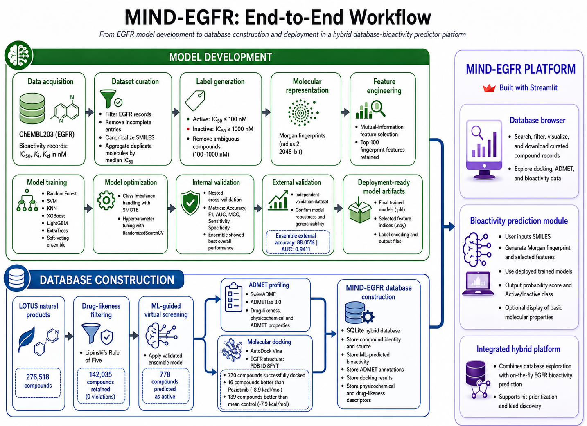

# MIND-EGFR

MIND-EGFR
Machine Intelligence for Natural Drugs targeting EGFR

A hybrid database-bioactivity predictor web platform for the discovery and prioritization of natural product-derived EGFR inhibitors.

Live app: https://mindegfr.streamlit.app

[Workflow image]

The workflow diagram is included in the GitHub repository as workflow.png. It should appear in README.md using:

  

## Overview

MIND-EGFR is an interactive web application designed to support natural product-based drug discovery targeting epidermal growth factor receptor (EGFR).

The platform integrates a curated natural product database with machine learning-based EGFR bioactivity prediction, ADMET annotation, drug-likeness profiling, toxicity prediction, and molecular docking results.

MIND-EGFR functions as a hybrid platform with two major components:

1. Database Browser
   Enables users to explore, filter, visualize, and download curated natural product records with integrated bioactivity, ADMET, toxicity, and docking information.

2. Bioactivity Predictor
   Allows users to predict EGFR inhibitory activity from user-provided SMILES using validated machine learning models.

## Why MIND-EGFR?

EGFR is an important therapeutic target in cancer research and drug discovery. Natural products provide a chemically diverse source of bioactive molecules, but identifying promising EGFR inhibitors from large natural product libraries requires efficient screening and prioritization.

MIND-EGFR helps researchers rapidly evaluate natural compounds by combining:

- Machine learning-based EGFR bioactivity prediction
- Drug-likeness and physicochemical profiling
- ADMET and toxicity annotation
- Molecular docking against EGFR
- Interactive database exploration
- On-the-fly prediction for new compounds

The platform is intended to support early-stage virtual screening, compound prioritization, and lead discovery.

## Key Features

### Database Browser

The database browser allows users to explore a curated natural product database containing predicted EGFR-related information.

Users can:

- Search compounds by LOTUS ID, compound name, or source organism
- Filter compounds by docking success, docking affinity, ADME properties, toxicity flags, and drug-likeness values
- View compound identity, SMILES, molecular formula, molecular weight, source organism, and physicochemical properties
- Inspect machine learning-based EGFR bioactivity predictions
- Explore ADMET, toxicity, and drug-likeness annotations
- Review molecular docking results against EGFR
- Download filtered compound records as CSV files

### Bioactivity Predictor

The bioactivity prediction module enables users to evaluate new compounds directly from SMILES input.

Users can:

- Paste SMILES manually
- Upload a CSV file containing a SMILES column
- Predict EGFR inhibitory activity using deployed trained models
- Obtain Active/Inactive class labels
- Obtain probability scores for predicted EGFR activity
- Compute basic molecular properties including:
  - Molecular weight
  - LogP
  - TPSA
  - Hydrogen bond donors
  - Hydrogen bond acceptors
  - Rotatable bonds
  - QED score
  - Lipinski violations
- Download prediction results as CSV files

## Database Construction

The MIND-EGFR database was constructed from the LOTUS natural product database using a virtual screening workflow.

Database construction summary:

- Natural products collected from LOTUS: 276,518 compounds
- Compounds passing Lipinski's Rule of Five with zero violations: 142,035 compounds
- Compounds predicted as active by ensemble ML screening: 778 compounds
- Compounds successfully docked into EGFR structure 8F1Y: 730 compounds
- Compounds with docking affinity better than Poziotinib (-8.9 kcal/mol): 16 compounds
- Compounds with docking affinity better than mean control affinity (-7.9 kcal/mol): 139 compounds

The final SQLite database stores:

- Compound identity and source information
- SMILES and physicochemical descriptors
- Drug-likeness properties
- ADMET annotations
- Toxicity predictions
- Machine learning-based EGFR bioactivity predictions
- Molecular docking results

## Machine Learning Model Development

The EGFR bioactivity prediction models were developed using the ChEMBL203 EGFR dataset.

### Dataset Preparation

The ChEMBL203 dataset was processed to generate a binary EGFR bioactivity dataset.

The preparation workflow included:

- Extraction of EGFR bioactivity records
- Selection of activity types IC50, Ki, and Kd in nM
- Use of IC50 values for final training dataset preparation
- RDKit-based canonicalization of SMILES
- Aggregation of duplicate molecules using median IC50
- Binary labeling of compounds:
  - Active: IC50 <= 100 nM
  - Inactive: IC50 >= 1000 nM
  - Compounds between 100-1000 nM were removed as ambiguous

### Model Training and Validation

The trained models used molecular fingerprints and supervised machine learning algorithms for EGFR activity prediction.

The model-development workflow included:

- Molecular representation using Morgan fingerprints, radius 2, 2048 bits
- Mutual information-based feature selection
- Selection of the top fingerprint features
- Class imbalance handling using SMOTE
- Hyperparameter optimization using RandomizedSearchCV
- Internal validation using nested cross-validation
- External validation using an independent validation dataset
- Final deployment of validated models into the MIND-EGFR app

### Models Included

The platform uses multiple validated classifiers:

- Random Forest
- Support Vector Machine
- K-Nearest Neighbors
- XGBoost
- LightGBM
- ExtraTrees
- Soft-voting ensemble model

The validated trained models were deposited into the MIND-EGFR Bioactivity Prediction Module for app-based EGFR activity prediction.

## ADMET and Molecular Docking Analysis

MIND-EGFR integrates both ligand-based prediction and structure-based screening information.

### ADMET Prediction

ADMET and drug-likeness properties were generated using:

- SwissADME
- ADMETlab 3.0

These annotations were stored in the MIND-EGFR database to help users evaluate pharmacokinetic, toxicity, and drug-likeness profiles of candidate compounds.

### Molecular Docking

Molecular docking was performed using AutoDock Vina against EGFR.

- Target: EGFR
- Protein structure: PDB ID 8F1Y
- Control benchmark: Poziotinib
- Docking results were integrated into the SQLite database

Docking scores are provided to support compound prioritization and structure-guided interpretation.

## How to Use MIND-EGFR

### 1. Open the Web App

Visit:

https://mindegfr.streamlit.app

### 2. Explore the Database Browser

Use the Database Browser mode to search and filter curated natural products.

You can filter compounds based on:

- Compound name
- LOTUS ID
- Source organism
- Docking success
- Docking affinity
- Better-than-control docking criteria
- GI absorption
- BBB permeability
- QED score
- Toxicity prediction flags

After filtering, users can inspect detailed compound information and download the selected results.

### 3. Use the Bioactivity Predictor

Use the Bioactivity Predictor mode to predict EGFR activity for new compounds.

Input options:

- Paste SMILES strings directly, one per line
- Upload a CSV file containing a SMILES column

Example input:

CCOc1cc2ncnc(Nc3ccc(F)c(Cl)c3)c2cc1OCC
COc1cc2ncnc(Nc3cccc(Cl)c3)c2cc1OC

For CSV upload, the file should contain a column named:

SMILES

The app returns EGFR bioactivity prediction results, probability scores, class labels, and basic molecular properties.

## Intended Users

MIND-EGFR is designed for:

- Natural product researchers
- Medicinal chemists
- Pharmacologists
- Computational biologists
- Cheminformatics researchers
- Drug discovery scientists
- Students and educators working in computational drug discovery

## Developers

Sheikh Sunzid Ahmed and M. Oliur Rahman
Plant Taxonomy and Ethnobotany Laboratory
Department of Botany
University of Dhaka

## License

This project is licensed under the MIT License.

## Disclaimer

MIND-EGFR is intended for research and educational use only. The bioactivity predictions, docking scores, ADMET annotations, toxicity predictions, and drug-likeness outputs are computational screening results.

These results should be interpreted as preliminary evidence for compound prioritization and should not be considered experimental or clinical validation. Any compound identified using MIND-EGFR requires appropriate experimental confirmation before biological, pharmacological, or therapeutic conclusions are made.
